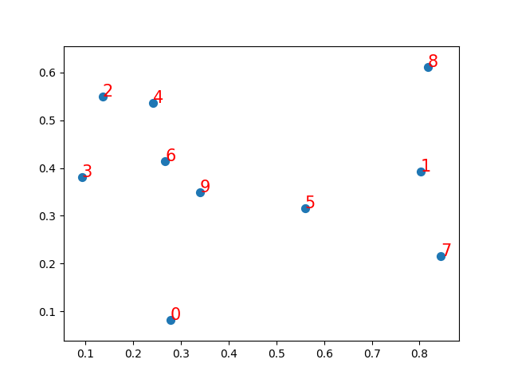
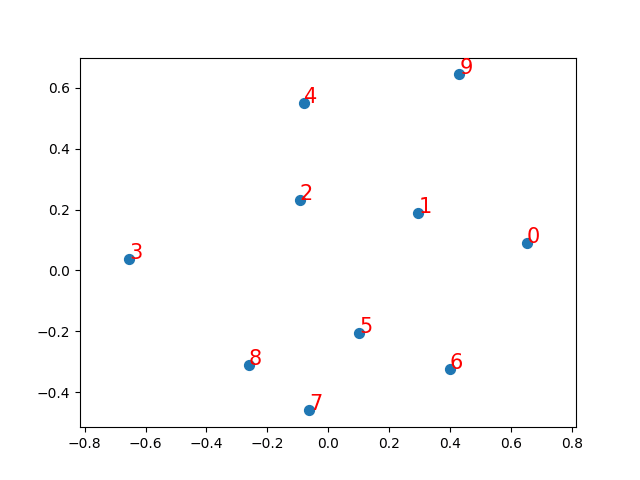

# distance_embedding
ノード間の距離関係を入力すると、それらを満たすようノードの位置を最適化するネットワークのテスト。

## train_test_dataset.py
次図のようなランダムな位置に配置したノードを用い検証を行ったもの。

以下のデータセット・モデルで学習すると、次図のようにノードの位置が教師として与えた距離関係に最適化される。

### test_dataset.py
ノードからランダムに2個取り出し、そのindex（a, b）と、a-b間の距離（dist）を提供するデータセット。このタスクは所謂教師あり学習で、indexが入力、distが教師データということになる。

### model.py
このタスクのためのネットワーク。一層のバイアスは用いないDense層（Embedding層とも呼ばれる）による、入力されたindexの位置を予測して返すもの。

